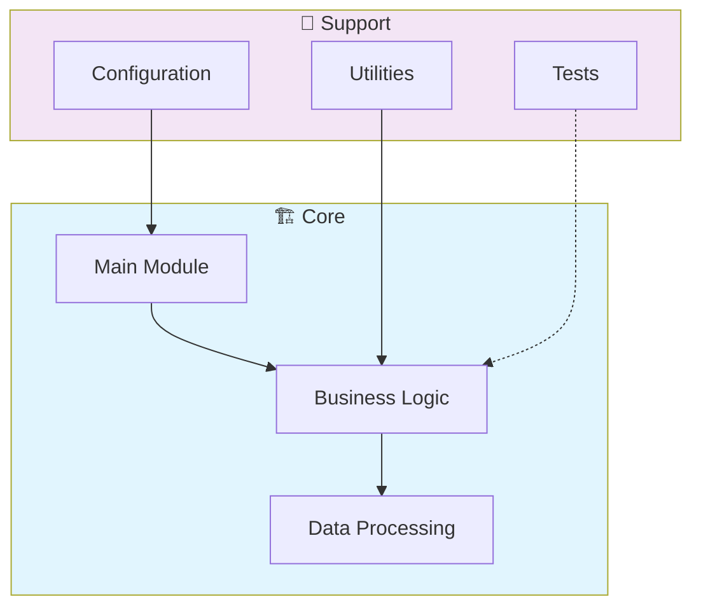

# 🚀 Enterprise Resource Planning System

> Professional Enterprise-Resource-Planning-System - Created by Gabriel Demetrios Lafis

[](https://img.shields.io/badge/)
[](https://img.shields.io/badge/)
[](https://img.shields.io/badge/)
[](LICENSE)

[English](#english) | [Português](#português)

---

## English

### 🎯 Overview

**Enterprise Resource Planning System** is a production-grade Java application complemented by CSS, HTML, JavaScript, SQL, Shell that showcases modern software engineering practices including clean architecture, comprehensive testing, containerized deployment, and CI/CD readiness.

The codebase comprises **7,249 lines** of source code organized across **39 modules**, following industry best practices for maintainability, scalability, and code quality.

### ✨ Key Features

- **🐳 Containerized**: Docker support for consistent deployment
- **📐 Clean Architecture**: Modular design with clear separation of concerns
- **🧪 Test Coverage**: Unit and integration tests for reliability
- **📚 Documentation**: Comprehensive inline documentation and examples
- **🔧 Configuration**: Environment-based configuration management

### 🏗️ Architecture



### 🚀 Quick Start

#### Prerequisites

- Java 21+ (JDK)
- Maven 3.9+

#### Installation

```bash
# Clone the repository
git clone https://github.com/galafis/Enterprise-Resource-Planning-System.git
cd Enterprise-Resource-Planning-System

# Build the project
mvn clean install
```

#### Running

```bash
mvn spring-boot:run
```

### 🐳 Docker

```bash
# Start all services
docker-compose up -d

# View logs
docker-compose logs -f

# Stop all services
docker-compose down

# Rebuild after changes
docker-compose up -d --build
```

### 🧪 Testing

```bash
# Run all tests
mvn test

# Run with coverage
mvn test jacoco:report
```

### 📁 Project Structure

```
Enterprise-Resource-Planning-System/
├── docker/
│   ├── mysql/
│   │   └── init.sql
│   ├── nginx/
│   │   └── ssl/
│   ├── scripts/
│   │   ├── backup.sh
│   │   ├── build.sh
│   │   └── deploy.sh
│   ├── README.md
│   └── docker-compose.yml
├── docs/          # Documentation
│   ├── api/           # API endpoints
│   │   └── README.md
│   ├── architecture/
│   │   └── README.md
│   ├── guides/
│   │   └── README.md
│   └── README.md
├── src/          # Source code
│   ├── main/
│   │   ├── java/
│   │   └── resources/
│   └── test/         # Test suite
│       └── java/
├── Dockerfile
├── LICENSE
├── README.md
├── complete_erp_system.sh
├── docker-compose.prod.yml
└── docker-compose.yml
```

### 🛠️ Tech Stack

| Technology | Description | Role |
|------------|-------------|------|
| **Java** | Core Language | Primary |
| **Docker** | Containerization platform | Framework |
| **Redis** | In-memory data store | Framework |
| Shell | 4 files | Supporting |
| HTML | 3 files | Supporting |
| SQL | 1 files | Supporting |
| CSS | 1 files | Supporting |
| JavaScript | 1 files | Supporting |

### 🚀 Deployment

#### Cloud Deployment Options

The application is containerized and ready for deployment on:

| Platform | Service | Notes |
|----------|---------|-------|
| **AWS** | ECS, EKS, EC2 | Full container support |
| **Google Cloud** | Cloud Run, GKE | Serverless option available |
| **Azure** | Container Instances, AKS | Enterprise integration |
| **DigitalOcean** | App Platform, Droplets | Cost-effective option |

```bash
# Production build
docker build -t Enterprise-Resource-Planning-System:latest .

# Tag for registry
docker tag Enterprise-Resource-Planning-System:latest registry.example.com/Enterprise-Resource-Planning-System:latest

# Push to registry
docker push registry.example.com/Enterprise-Resource-Planning-System:latest
```

### 🤝 Contributing

Contributions are welcome! Please feel free to submit a Pull Request. For major changes, please open an issue first to discuss what you would like to change.

1. Fork the project
2. Create your feature branch (`git checkout -b feature/AmazingFeature`)
3. Commit your changes (`git commit -m 'Add some AmazingFeature'`)
4. Push to the branch (`git push origin feature/AmazingFeature`)
5. Open a Pull Request

### 📄 License

This project is licensed under the MIT License - see the [LICENSE](LICENSE) file for details.

### 👤 Author

**Gabriel Demetrios Lafis**
- GitHub: [@galafis](https://github.com/galafis)
- LinkedIn: [Gabriel Demetrios Lafis](https://linkedin.com/in/gabriel-demetrios-lafis)

---

## Português

### 🎯 Visão Geral

**Enterprise Resource Planning System** é uma aplicação Java de nível profissional, complementada por CSS, HTML, JavaScript, SQL, Shell que demonstra práticas modernas de engenharia de software, incluindo arquitetura limpa, testes abrangentes, implantação containerizada e prontidão para CI/CD.

A base de código compreende **7,249 linhas** de código-fonte organizadas em **39 módulos**, seguindo as melhores práticas do setor para manutenibilidade, escalabilidade e qualidade de código.

### ✨ Funcionalidades Principais

- **🐳 Containerized**: Docker support for consistent deployment
- **📐 Clean Architecture**: Modular design with clear separation of concerns
- **🧪 Test Coverage**: Unit and integration tests for reliability
- **📚 Documentation**: Comprehensive inline documentation and examples
- **🔧 Configuration**: Environment-based configuration management

### 🏗️ Arquitetura


### 🚀 Início Rápido

#### Prerequisites

- Java 21+ (JDK)
- Maven 3.9+

#### Installation

```bash
# Clone the repository
git clone https://github.com/galafis/Enterprise-Resource-Planning-System.git
cd Enterprise-Resource-Planning-System

# Build the project
mvn clean install
```

#### Running

```bash
mvn spring-boot:run
```

### 🐳 Docker

```bash
# Start all services
docker-compose up -d

# View logs
docker-compose logs -f

# Stop all services
docker-compose down

# Rebuild after changes
docker-compose up -d --build
```

### 🧪 Testing

```bash
# Run all tests
mvn test

# Run with coverage
mvn test jacoco:report
```

### 📁 Estrutura do Projeto

```
Enterprise-Resource-Planning-System/
├── docker/
│   ├── mysql/
│   │   └── init.sql
│   ├── nginx/
│   │   └── ssl/
│   ├── scripts/
│   │   ├── backup.sh
│   │   ├── build.sh
│   │   └── deploy.sh
│   ├── README.md
│   └── docker-compose.yml
├── docs/          # Documentation
│   ├── api/           # API endpoints
│   │   └── README.md
│   ├── architecture/
│   │   └── README.md
│   ├── guides/
│   │   └── README.md
│   └── README.md
├── src/          # Source code
│   ├── main/
│   │   ├── java/
│   │   └── resources/
│   └── test/         # Test suite
│       └── java/
├── Dockerfile
├── LICENSE
├── README.md
├── complete_erp_system.sh
├── docker-compose.prod.yml
└── docker-compose.yml
```

### 🛠️ Stack Tecnológica

| Tecnologia | Descrição | Papel |
|------------|-----------|-------|
| **Java** | Core Language | Primary |
| **Docker** | Containerization platform | Framework |
| **Redis** | In-memory data store | Framework |
| Shell | 4 files | Supporting |
| HTML | 3 files | Supporting |
| SQL | 1 files | Supporting |
| CSS | 1 files | Supporting |
| JavaScript | 1 files | Supporting |

### 🚀 Deployment

#### Cloud Deployment Options

The application is containerized and ready for deployment on:

| Platform | Service | Notes |
|----------|---------|-------|
| **AWS** | ECS, EKS, EC2 | Full container support |
| **Google Cloud** | Cloud Run, GKE | Serverless option available |
| **Azure** | Container Instances, AKS | Enterprise integration |
| **DigitalOcean** | App Platform, Droplets | Cost-effective option |

```bash
# Production build
docker build -t Enterprise-Resource-Planning-System:latest .

# Tag for registry
docker tag Enterprise-Resource-Planning-System:latest registry.example.com/Enterprise-Resource-Planning-System:latest

# Push to registry
docker push registry.example.com/Enterprise-Resource-Planning-System:latest
```

### 🤝 Contribuindo

Contribuições são bem-vindas! Sinta-se à vontade para enviar um Pull Request.

### 📄 Licença

Este projeto está licenciado sob a Licença MIT - veja o arquivo [LICENSE](LICENSE) para detalhes.

### 👤 Autor

**Gabriel Demetrios Lafis**
- GitHub: [@galafis](https://github.com/galafis)
- LinkedIn: [Gabriel Demetrios Lafis](https://linkedin.com/in/gabriel-demetrios-lafis)
